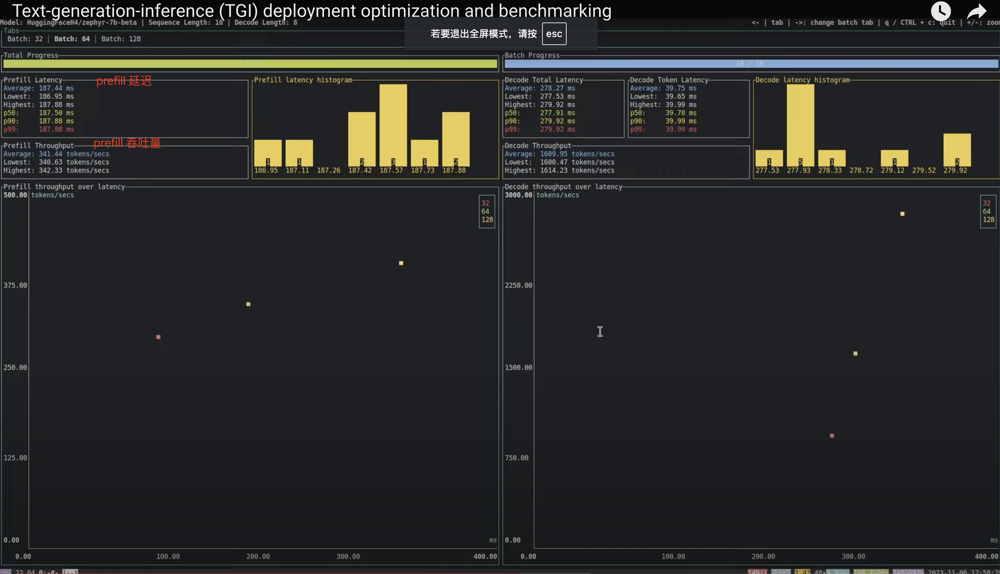
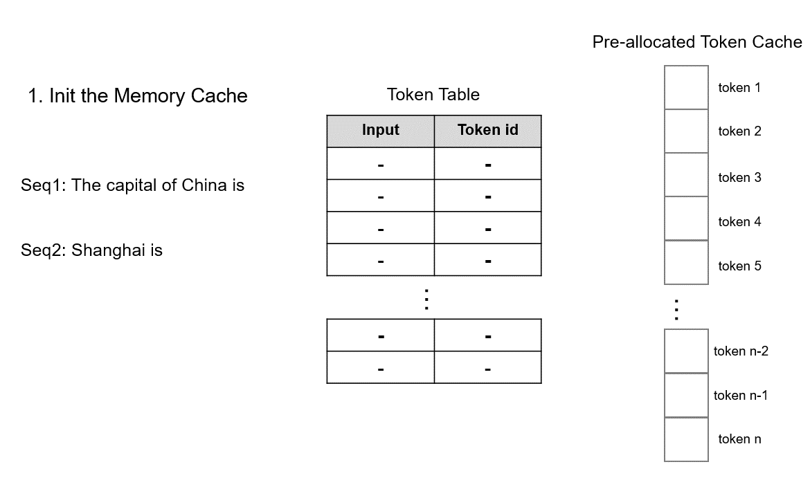

- [一 llm 服务引擎特性比较](#一-llm-服务引擎特性比较)
  - [1.1 vllm](#11-vllm)
  - [1.2 TGI](#12-tgi)
  - [1.3 TensorRT-LLM](#13-tensorrt-llm)
    - [TensorRT-LLM 量化方法](#tensorrt-llm-量化方法)
  - [1.4 lightllm](#14-lightllm)
- [参考资料](#参考资料)

## 一 llm 服务引擎特性比较

这里我给出各大 llm 服务引擎的主要特性总结，大家都有的常规或者体现不出差距的特性则忽略。

### 1.1 vllm

[vllm](https://github.com/vllm-project/vllm)

1. **从吞吐量角度看，作者称 `vllm` 在大部分模型和 GPU 上都是实现了 SOTA**。
2. 在 `llm` 推理层面的优化算法和模型量化上，支持的比较全和快。如支持最新的：
    - `Prefix Caching`：提升多论对话场景的问答效果和速度；
    - `Speculative Decoding`：在系统负载较低时，利用预测解码可以减少延迟。
    - `Chunked prefill`: 将超长 prompt 拆分成多个块并和内存密集型的 decode 请求一起处理。
3. 支持 `weight-only` 的低比特量化 AWQ 及其他量化算法。
4. 首次提出 `PagedAttention` kv cache 管理、分配算法，并已被广大 llm 推理服务框架应用！

PagedAttention 的运行机制如下图所示:

### 1.2 TGI

[TGI](https://github.com/huggingface/text-generation-inference)

- 性能监测工具好用且优雅；
- 目前我看到的**最优服务调度策略**，基于 rust 编写（高性能）；
- 原生完美支持 transformers 库（毕竟出自一家公司抱抱脸）；
- 框架扩展性强，推理层可定制大模型推理逻辑（你可以把推理层换成 lightllm，就可以复用 tgi 的高效服务调度模块）
- 同样支持 `AWQ`、`GPTQ` 等量化算法。

动态性能测试工具:

静态性能测试工具

### 1.3 TensorRT-LLM

仓库地址：[TensorRT-LLM](https://github.com/NVIDIA/TensorRT-LLM)，官方文档地址: [TensorRT-LLM-guide](https://nvidia.github.io/TensorRT-LLM/quick-start-guide.html)

1. **极致的 kernel 优化带来了 SOTA 的 latency 指标**（毕竟在 cuda 内核优化上，英伟达自家舍我其谁），具体来说：
    - `attention` 层：decode（generate）阶段的 attention 操作是 gemv，因为 seq_len = 1 的 MQA/GQA 无法充分发挥 tensor core 算力，提出一个新的 `XQA` kernel 用于做 logical shape 的变换 (`[bs,1,num q head,head dim]x[bs,k len,num kv head,head dim] => [bs, num kv head, num q head/num kv head, head dim]x[bs,num kv head,k len, head dim]`）。本质上是将 `batch gemv` 转换成 `batch gemm` 操作，以充分发挥 tensor core 算力。
    - `FFN` 层: 基于 `cutlass` 和 `cublas` 库实现了极致的 `gemm` 性能。

2. **貌似是最全的量化算法支持**，如 `SQ(SmoothQuant)`、`GPTQ`、`AWQ`，以及支持 `FP8(w8a8)、AWQ(w4a16)、AWQ(w4a8)、SQ(w8a8)、GPTQ(w4a16)`。
3. 新的批处理策略-`in-flight batching`：基于 ORCA 论文里提出的 `continuous batching` 实现，代码闭源，在代码里是被称作 `Batch Manager` 的组件。功能都是允许在每次 token 生成循环迭代中动态添加新请求，并返回新完成的请求。据说性能更好。
4. 图优化技术：通过 `Module Rewriting` 和 `Graph Rewriting` 技术实现，相比 vllm 使用 torch 自带的 cuda graph 优化，TensorRT-LLM 原生支持图优化，并提供图优化技术，应该效率更高，具体说：
   - **模块重写**：在执行 forward 方法前，调整 Module 实例的成员（即构建 TensorRT 图的过程）。它在网络表示的最高层级上操作，便于修改一系列操作（例如为 SmoothQuant 调整 GEMM + 激活函数的组合）。
   - **图重写**：在执行 forward 方法后，基于 TensorRT 的 `INetworkDefinition` 进行操作。它以更细致的 `ILayer` 层次进行操作，能够跨多个 Module 实例调整结构，通常用于**层融合**操作。

#### TensorRT-LLM 量化方法

TensorRT-LLM 量化方法主要包括三个核心部分：

- 权重的精度格式
- 激活的精度格式
- 校准算法（基于校准集）

在小批量推理（批量大小 ≤ 4）场景中，内存带宽是主要考量，因此更倾向于仅对权重量化的方式。而在大批量推理场景（如服务场景，批量大小 ≥ 16）中，内存带宽和计算密度同样重要。因此，**推荐选择对权重和激活都进行量化的方法**。对于批量大小 ≥ 16 的场景，量化方法的选择可以依据具体模型进行调整。建议优先尝试 FP8，因为通常其性能和准确性最佳。如果结果无法满足特定需求，可以进一步尝试 Int8 SmoothQuant（Int8 SQ），然后是 AWQ 和/或 GPTQ。更多详情请参考[官方文档](https://github.com/NVIDIA/TensorRT-LLM/blob/main/docs/source/blogs/quantization-in-TRT-LLM.md)。

在相同的延迟预算下，使用 `XQA` 优化后，`Llama-70B` 在 `H200` 上的吞吐量提升可达 2.4 倍。

|Model     |GPUs | Input Length | Output Length | Throughput w/o XQA (tok/s/GPU) | Throughput w/ XQA (tok/s/GPU) | Speedup |
|:---------|:----|:-------------|:--------------|:-------------------|:------------------|:--------|
|Llama-70B |   1 |          128 |          2048 |              1,227 |             2,941 | 2.4x
|          |   8 |          128 |          2048 |             13,232 |            25,300 | 1.9x

### 1.4 lightllm

[lightllm](https://github.com/ModelTC/lightllm)

1. 首次提出 `tokenattention`，本质上是粒度为 `token` 级别的 `pagedattention` 优化，最大的特点是内存几乎零浪费。
2. **多进程协同**：`tokenization`、模型推理、`detokenization` 等工作异步进行，大幅提高 GPU 利用率，减少 gpu 空泡现象。

`TokenAttention` 的运行机制如下图所示，具体原理描述请参考 lightllm [官方文档](https://lightllm-cn.readthedocs.io/en/latest/dev/token_attention.html)。

## 参考资料

- [漫谈TensorRT-LLM的关键技术 (未完待续)](https://zhuanlan.zhihu.com/p/917457226)